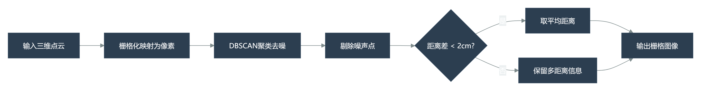
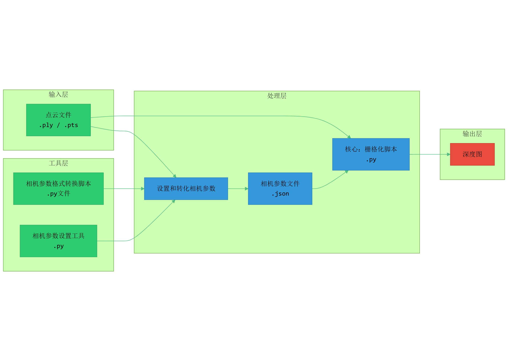
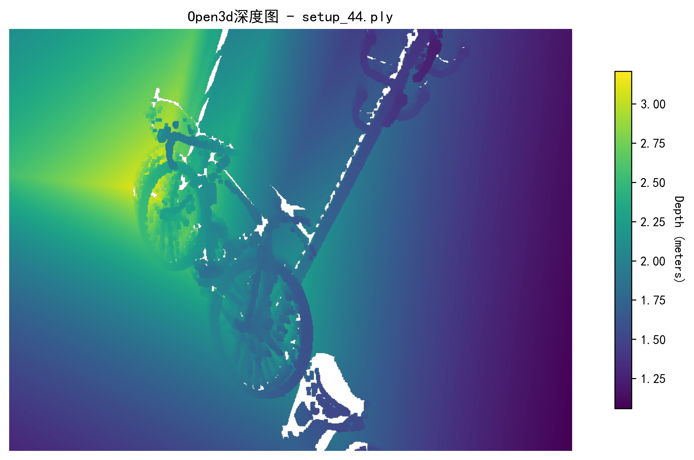
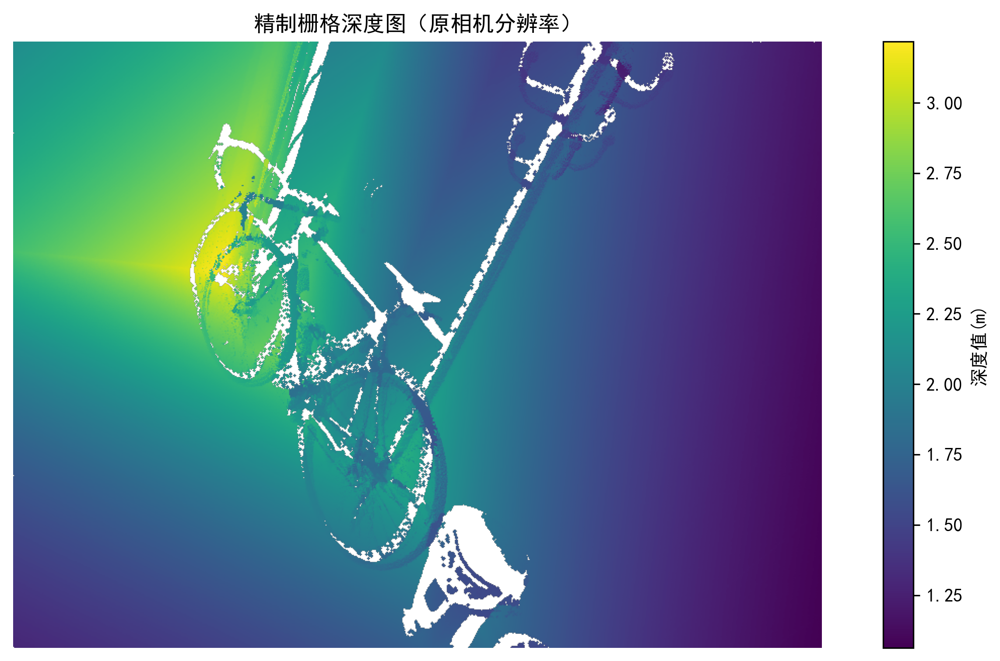

# 一种基于DBSCAN算法的点云深度图栅格化项目

## 项目背景
深度图（Depth Map）是一种表示场景中物体与相机距离信息的二维图像，作为连接二维与三维视觉的关键桥梁，在自动驾驶、具身智能、机器人导航和三维重建等领域具有重要应用价值。本项目实现了一种基于**DBSCAN算法**的高效的三维点云到深度图的栅格化转换方法，通过自定义的投影、聚类和优化算法，生成高质量的深度图像。

项目起源于实习项目，目标是构建一个完整的点云处理流水线，包括点云加载、相机参数处理、投影计算、深度图生成和可视化等功能。通过本项目，不仅实现了基础的栅格化功能，还深入研究了不同相机参数格式的兼容性，开发了多种实用工具脚本，最终项目**复现了一种精度较高的3维点云栅格化流程**。


## 核心技术栈
### 主要依赖库
- Open3D - 点云数据加载、处理和可视化
- OpenCV - 图像处理和形态学操作
- NumPy - 数值计算和矩阵运算
- SciPy - 距离变换和科学计算
- Scikit-learn - DBSCAN聚类算法
- Matplotlib - 深度图可视化
- tqdm - 进度条显示

### 核心算法流程
1. 坐标转换：将点云从世界坐标系转换到相机坐标系

2. 投影映射：3D点投影到2D图像平面

3. 哈希映射：建立像素位置到深度值的映射表

4. DBSCAN聚类：处理同一像素的多个深度值

5. 深度确定：通过极值分析确定最终深度值

6. 后处理优化：插值填充、形态学处理等



### 三维点云栅格化项目流程
要完成栅格化，需要提供点云文件（ply或其他格式）和相机参数（json文件，确定观察视角）。


## 技术挑战
### （1）相机参数格式兼容性
核心发现：不同软件（Open3D、OpenCV、ROS）使用不同的相机外参定义

行向量派 vs 列向量派：旋转矩阵的两种主要定义方式

行向量派：描述世界坐标到相机坐标的旋转（OpenCV、ROS）

列向量派：描述相机坐标到世界坐标的旋转（Open3D约定）

解决方案：实现双重兼容性，支持两种格式自动识别和处理

### （2）投影计算的数学精确性
深入理解三维到二维映射的数学原理

正确处理坐标系的旋转和平移变换

实现负深度点过滤和图像边界检查

### （3）大规模数据处理优化
哈希表实现高效的空间映射

DBSCAN聚类算法优化，处理像素级多深度值

进度监控和内存管理

### （4）可视化一致性
确保投影计算与三维可视化结果一致

实现多种可视化模式（带标签/纯深度图）

批量处理和结果保存

## 贡献和成果
项目点云文件：data/point_cloud.ply

项目原始相机参数文件：data/cameras.json

### 主要功能模块
1.相机参数处理工具套件
- capture_view.py - 自定义视角捕获和参数保存

- split_cameras.py - 批量分割相机参数文件（项目使用的相机参数原始文件需要用合适的格式进行分离）

- json_translation.py - 相机参数格式转换（用于将不满足open3d格式的相机参数文件转化为正确格式）

- load_view.py - 加载并可视化相机视角（行向量派）

- load_ViewParameters.py - 手动设置相机视角（列向量派）

2.点云处理和可视化
- Preprocessing.py - 点云降采样和预处理

- read_PointCloud.py - 点云信息读取和相机坐标系可视化

- Read_Muti_view.py - 点云读取和多相机坐标系批量可视化

3.核心栅格化引擎
run_rasterization.py - 主栅格化脚本，支持：

- 单文件和批量处理模式

- 双相机外参格式兼容（A/B模式）

- 可配置的DBSCAN参数

- 插值填充和形态学优化

- 深度图缩放和纯图生成

## 技术创新点
1.双模式投影计算
```python
# 模式A：行向量派（适用于OpenCV格式）
points_cam = np.dot(self.extrinsic[:3, :3], points.T).T + self.extrinsic[:3, 3]

# 模式B：列向量派（适用于Open3D格式）
points_cam = (points - self.extrinsic[:3, 3]) @ self.extrinsic[:3, :3]
```

本项目的技术创新体现在多个层面，其中智能深度值选择策略构成了算法的核心优化。系统采用了多层次决策机制：首先进行阈值验证，当同一像素点的深度变化小于2厘米时直接取平均值处理，这高效解决了大部分简单场景；对于复杂情况则引入DBSCAN聚类算法，有效区分不同距离层次的点云数据；最终从主聚类中选择距离最近的深度值作为代表，这种分层处理方式在保证精度的同时显著提升了计算效率。

在后处理优化方面，我们开发了完整的图像修复管线以提升深度图质量。针对投影过程中产生的数据空缺，系统采用最近邻插值算法进行智能填充，同时结合形态学闭运算预处理，有效识别并优先修复小尺度孔洞区域。创新性地引入了边缘保护机制，防止图像边界处的异常填充，这些优化措施使得生成的深度图更加完整平滑，显著提升了视觉效果和应用价值。

在工程化实现上，项目构建了高度集成的处理框架。通过命令行参数接口实现了灵活的操作控制，支持单文件与批量处理双模式；完善的进度监控和日志系统提供了透明的执行过程；模块化的架构设计确保各功能组件既能独立工作又可协同运行。这种工程化设计不仅便于日常使用和维护，更为后续的功能扩展和系统集成奠定了坚实基础，体现了从算法研究到工程实践的全流程创新。

## 使用说明
### 快速开始
安装项目依赖：`pip install -r requirements.txt`

使用相机参数分离脚本和转化脚本处理项目的相机参数原始文件：
```python
# 1.分离相机参数
python algorigthms/split_cameras.py #在脚本中自定义相机参数文件路径

# 2.转化分离后的相机参数
python algorigthms/json_translation.py #在脚本中自定义相机参数文件夹路径
```

使用核心栅格化脚本进行栅格化：
```python
# 批处理模式
python run_rasterization.py \
  -p data/point_cloud.ply \
  -d data/Trans_Camera_Param \
  -o DepthMap_Set \
  --R_kind B

# 单文件模式
python run_rasterization.py \
  -p data/point_cloud.ply \
  -f data/Trans_Camera_Param/camera_001.json \
  --output_path depth_map.png
```

### 重要提示
- 使用前确认相机参数的格式（行向量派或列向量派）

- 根据点云密度调整DBSCAN参数

- 批量处理时注意内存使用情况

## 项目成果与贡献
### 优势
- 完整的点云处理流水线：从原始点云到深度图的端到端解决方案

- 相机参数兼容性框架：解决了不同软件间数据交换的核心难题

- 工业级工具集：9个专业脚本覆盖各种使用场景

- 深度技术文档：详细的相机外参研究和工程实践总结

- 可扩展的代码架构：易于集成到更大的计算机视觉系统中

### 本项目的栅格化方法与open3d的默认栅格化方法效果对比
open3d:


本项目的栅格化方法：

该项目的栅格化效果在保持大部分场景深度显示正确的情况下，比open3d栅格化效果在细粒度和精度上有更高的水准。

### 项目价值和未来发展
本项目不仅具有显著的教育和工程价值，更在实际应用中展现出广阔的前景。从教育角度看，它让开发者深入理解了三维计算机视觉的核心原理，包括坐标系变换、投影几何和点云处理等基础知识，为学习更复杂的视觉算法奠定了坚实基础。在工程实践方面，项目提供了一套完整的工业级工具集，涵盖从数据预处理到深度图生成的全流程，并解决了不同软件间相机参数兼容性这一关键技术难题，其模块化设计和详细文档体系也体现了良好的工程规范，便于团队协作和系统集成。

展望未来，本项目可在多个方向进行深化拓展。算法层面可以进一步优化聚类和插值方法，探索基于深度学习的深度估计算法融合，提升处理精度和效率。性能方面可朝着实时处理和多传感器融合方向发展，结合RGB图像生成彩色深度图，增强场景理解能力。随着自动驾驶和机器人技术的快速发展，这套点云处理框架有望应用于更复杂的实际场景，未来还可考虑云平台部署，支持分布式大规模处理，并通过Web接口提供服务，使其成为三维视觉领域更加通用和强大的基础工具平台。


> 作者：胡景裕
>
> 项目周期：2024年实习项目
>
> 技术领域：计算机视觉、三维重建、点云处理、深度估计
>
> open3d原理文档参考：<https://www.open3d.org/docs/release/>
